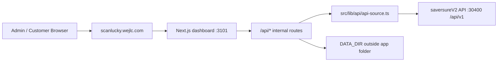

# Developer Handoff Plan — Scan Lucky Rich Dashboard

Last updated: 2026-06-15

เอกสารนี้คือคู่มือสำหรับทีมถัดไปที่ต้องรับช่วงพัฒนา `julaherb-crm-board/scan-lucky-rich-dashboard` ต่อจากสถานะ production ปัจจุบัน ให้ใช้ไฟล์นี้เป็น entry point ก่อนเปิดไฟล์อื่น

## 1. สถานะล่าสุดที่ต้องรู้ก่อนเริ่ม

- Branch ที่ใช้อยู่: `feat/saversure-api-integration`
- Remote: `origin/feat/saversure-api-integration`
- Production PM2: `scan-lucky-rich-prod`
- Production runtime path: `D:\AI_WORKSPACE\Production\scan-lucky-rich`
- Git working path: `D:\AI_WORKSPACE\AI_Project\Github\julaherb-crm-board\scan-lucky-rich-dashboard`
- Port จริงของ dashboard: `3101`
- Public domain: `https://scanlucky.wejlc.com`
- `localhost:3100` ไม่ใช่โปรเจกต์นี้ ตอนนี้เป็น `We-Purchase`
- ข้อมูล runtime ที่มี PII อยู่ใน `DATA_DIR` นอก app folder: `D:\AI_WORKSPACE\Production\scan-lucky-rich-data`

สถานะ git ณ 2026-06-15:

- Local branch ตรงกับ remote commit ล่าสุด (`0 ahead / 0 behind`)
- แต่มี source files ที่แก้แล้วและ deploy เข้า production copy แล้ว ยังไม่ได้ commit/push:
  - `scan-lucky-rich-dashboard/src/components/tabs/OverviewTab.tsx`
  - `scan-lucky-rich-dashboard/src/lib/api/api-source.ts`
  - `scan-lucky-rich-dashboard/src/lib/api/types.ts`

ทีมถัดไปควร commit/push 3 ไฟล์นี้ก่อนทำงานเพิ่ม ถ้าต้องการให้ GitHub/webhook สะท้อน production state ล่าสุด

## 2. Architecture แบบสั้น

Dashboard นี้เป็น Next.js app ที่ทำหน้าที่เป็น read-only consumer ของ saversureV2 ผ่าน HTTP API



หลักการสำคัญ:

- ห้ามแตะ DB หรือ code ของ saversureV2 โดยตรงจาก dashboard นี้
- Dashboard อ่านข้อมูลผ่าน API เท่านั้น
- API/หน้า public แสดง aggregate ได้
- API ที่มี PII ต้องล็อกด้วย `ADMIN_KEY`
- `.env.local`, token, password, claims files, winners raw data ห้าม commit

## 3. วิธีรันและตรวจสอบ

### Local development

```powershell
cd D:\AI_WORKSPACE\AI_Project\Github\julaherb-crm-board\scan-lucky-rich-dashboard
npm install
npm run dev
```

เปิดที่:

```text
http://localhost:3101
```

### Production

```powershell
pm2 describe scan-lucky-rich-prod
pm2 logs scan-lucky-rich-prod --lines 100 --nostream
```

Production app รันจาก:

```text
D:\AI_WORKSPACE\Production\scan-lucky-rich
```

ตรวจ port:

```powershell
Invoke-WebRequest -UseBasicParsing http://localhost:3101
```

ควรได้ title:

```text
สแกนลุ้นรวย สวยลุ้นล้าน — Dashboard
```

## 4. Deploy workflow ที่ถูกต้อง

เส้นทางปกติ:

1. แก้ source ใน Git working path
2. `npm run build`
3. commit และ push branch `feat/saversure-api-integration`
4. we-platform webhook จะ deploy เข้า `D:\AI_WORKSPACE\Production\scan-lucky-rich`
5. ตรวจ PM2 และ smoke test ผ่าน domain

คำสั่งตรวจหลัง deploy:

```powershell
Invoke-RestMethod "https://scanlucky.wejlc.com/api/scans/totals?from=2026-05-16&to=2026-06-12"
Invoke-RestMethod "https://scanlucky.wejlc.com/api/daily?from=2026-01-01&to=2026-06-12"
Invoke-RestMethod "https://scanlucky.wejlc.com/api/system/uptime?from=2026-01-01&to=2026-06-12"
```

Expected:

- ทุก endpoint ตอบ HTTP 200
- `/api/daily?from=2026-01-01...` ต้องไม่ 500 แม้ส่งวันก่อนเริ่มแคมเปญ
- `/api/system/uptime` ต้องมี `ongoingCount=0` ถ้าไม่มี incident ที่ยังไม่ resolve

## 5. Env และ secret ที่ต้องมี

Production env อยู่ที่:

```text
D:\AI_WORKSPACE\Production\scan-lucky-rich\.env.local
```

ต้องมี key เหล่านี้:

```ini
DATA_SOURCE=api
SAVERSURE_API_BASE_URL=http://<host>:30400/api/v1
SAVERSURE_API_TOKEN=<jwt>
SAVERSURE_CAMPAIGN_NAME=สแกนลุ้นรวย สวยลุ้นล้าน
SAVERSURE_LOGIN_EMAIL=<admin-email>
SAVERSURE_LOGIN_PASSWORD=<admin-password>
SAVERSURE_TENANT_ID=00000000-0000-0000-0000-000000000001
DATA_DIR=D:\AI_WORKSPACE\Production\scan-lucky-rich-data
ADMIN_KEY=<secret>
```

ห้าม print token/password ลง log หรือ commit

## 6. Auth และ token refresh

ล่าสุด `src/lib/api/api-source.ts` ถูกแก้ให้:

- อ่าน token จาก `.env.local`
- refresh token อัตโนมัติเมื่อ upstream ตอบ `401`
- เขียน token ใหม่กลับ `.env.local`
- retry request เดิมอีกครั้ง

Manual fallback ถ้า token ยังมีปัญหา:

```powershell
Invoke-WebRequest -UseBasicParsing -Method POST "http://localhost:3101/api/auth/refresh"
pm2 restart scan-lucky-rich-prod --update-env
```

หมายเหตุ: endpoint refresh ถูกออกแบบให้เรียกจาก localhost เท่านั้น

## 7. Date range rule ของ campaign

Campaign เริ่มวันที่:

```text
2026-05-16
```

ปัญหาที่เจอแล้ว:

- UI ส่ง `from=2026-01-01`
- saversureV2 `/dashboard/campaign-daily` ตอบ `400`
- Dashboard กลายเป็น `500`

Fix ล่าสุด:

- `api-source.ts` clamp range ก่อนยิง `campaign-daily`
- ถ้า `from` ก่อน `2026-05-16` ให้เริ่มยิง upstream ที่ `2026-05-16`
- ถ้าทั้ง range อยู่ก่อน campaign ให้คืน empty rows แทนการ throw

ห้ามลบ logic นี้ เว้นแต่ saversureV2 รองรับ historical/pre-campaign campaign daily แล้วจริง

## 8. System uptime card

ปัญหาที่เจอแล้ว:

- `/api/system/uptime` คืน historical incident ล่าสุดที่ resolve แล้ว
- UI เอา `outages[0]` มาแสดงเป็นสถานะปัจจุบัน
- การ์ดขึ้น `ล่ม 0.2ชม.` ทั้งที่ระบบปกติแล้ว

Fix ล่าสุด:

- `OutageInfo` มี `isOngoing?: boolean`
- `getUptime()` map `isOngoing = !resolved_at`
- `OverviewTab` แสดง "ล่ม" เฉพาะ incident ที่ยัง ongoing
- Historical outage ยังใช้คำนวณ uptime/report ได้เหมือนเดิม

## 9. Public/PII gate

Public:

- `/`
- `/winners`
- `/claim`
- aggregate API ที่ไม่เปิดเผย PII

Protected by `ADMIN_KEY`:

- `/api/print-slips`
- `/api/print-slips-pdf`
- `/api/claim/file`
- `/api/draw/claims`
- `/api/draw/winners`
- `/api/customers/search`

วิธีปลดล็อกสำหรับ admin:

- เปิด `?key=<ADMIN_KEY>` ครั้งแรกเพื่อ set cookie
- หรือส่ง header `x-admin-key`

อย่าเปลี่ยนนโยบายนี้โดยไม่คุยกับ owner เพราะเคยปรับแล้วหลายรอบ และรอบล่าสุดเลือกให้หน้าเว็บเปิด public แต่ล็อกเฉพาะ PII

## 10. Data และไฟล์ที่ห้าม commit

ห้าม commit:

- `.env*`
- `data/`
- `draw-winners.json`
- `draw-claims.json`
- claims uploaded files
- raw print slips หรือ export ที่มีชื่อ/เบอร์ลูกค้า
- Excel/PDF/PPTX ที่มี PII เว้นแต่ได้รับอนุญาตชัดเจน

Runtime data ต้องอยู่นอก app folder เพื่อไม่โดน deploy purge:

```text
D:\AI_WORKSPACE\Production\scan-lucky-rich-data
```

## 11. Smoke test checklist ก่อนส่งงาน

รัน build:

```powershell
cd D:\AI_WORKSPACE\AI_Project\Github\julaherb-crm-board\scan-lucky-rich-dashboard
npm run build
```

ตรวจ local หรือ production:

```powershell
Invoke-WebRequest -UseBasicParsing "https://scanlucky.wejlc.com/winners"
Invoke-WebRequest -UseBasicParsing "https://scanlucky.wejlc.com/claim"
Invoke-RestMethod "https://scanlucky.wejlc.com/api/daily?from=2026-01-01&to=2026-06-12"
Invoke-RestMethod "https://scanlucky.wejlc.com/api/members/daily?from=2026-01-01&to=2026-06-12"
Invoke-RestMethod "https://scanlucky.wejlc.com/api/scans/totals?from=2026-01-01&to=2026-06-12"
Invoke-RestMethod "https://scanlucky.wejlc.com/api/system/uptime?from=2026-01-01&to=2026-06-12"
```

ตรวจ PII gate:

```powershell
try { Invoke-WebRequest -UseBasicParsing "https://scanlucky.wejlc.com/api/print-slips?from=2026-05-16&to=2026-06-12" } catch { $_.Exception.Response.StatusCode.value__ }
```

Expected: `401` เมื่อไม่ส่ง key

## 12. งานต่อที่ควรวางแผน

Priority 0 — ทำให้ repo ตรงกับ production:

- commit/push 3 ไฟล์ที่แก้ล่าสุด
- หลัง push ให้รอ webhook deploy แล้ว smoke test อีกครั้ง

Priority 1 — ลด false alarm และเพิ่ม observability:

- แยก current health กับ historical uptime ใน UI ให้ชัดกว่าเดิม
- เพิ่ม timestamp "last checked" ให้สถานะระบบ
- ถ้า monitor/incidents มี check_name/check_target ให้ filter เฉพาะ target ที่เกี่ยวกับ campaign flow จริง

Priority 2 — ทำ dashboard ให้ data-real ครบขึ้น:

- เพิ่ม endpoint หรือ mapping สำหรับ time-of-day จริง
- เพิ่ม per-SKU daily timeseries จริง แทน snapshot จาก `campaign-report`
- แยก distinct users จาก sum-of-daily ให้ชัดในทุก tab
- ลด static/mock components ที่เหลือ โดยเฉพาะ tab ที่ยังใช้ `DAILY_ENTRIES`

Priority 3 — Ops flow:

- ตรวจ flow จับรางวัล end-to-end ก่อนรอบประกาศจริง
- ทดสอบ `/winners` และ `/claim` จากมือถือ 4G
- ตรวจ PDF print slips รอบใหญ่โดยเลือกช่วงวันแคบก่อนเสมอ

## 13. ไฟล์ที่ทีมถัดไปควรอ่าน

- `obsidian/00-INDEX.md` — timeline และ source-of-truth ล่าสุด
- `obsidian/00-RULES.md` — guardrails
- `obsidian/27-WePlatform-Migration-2026-06-12.md` — production/we-platform setup
- `scan-lucky-rich-dashboard/DEPLOY.md` — deploy/runtime detail
- `scan-lucky-rich-dashboard/src/lib/api/api-source.ts` — mapping layer หลัก
- `scan-lucky-rich-dashboard/src/middleware.ts` — ADMIN_KEY gate
- `scan-lucky-rich-dashboard/src/components/tabs/OverviewTab.tsx` — overview dashboard UI

## 14. ห้ามทำ

- ห้ามใช้ `git reset --hard` หรือ revert งานคนอื่นโดยไม่ถาม
- ห้ามแก้ production copy อย่างเดียวแล้วลืม sync กลับ source
- ห้ามเปิด PII API public
- ห้ามเอา token/password/ADMIN_KEY ไป commit
- ห้าม assume ว่า `localhost:3100` คือโปรเจกต์นี้
- ห้ามลบ `DATA_DIR` หรือย้ายกลับเข้า app folder

## 15. Quick start สำหรับทีมใหม่

```powershell
cd D:\AI_WORKSPACE\AI_Project\Github\julaherb-crm-board
git status --short --branch
git fetch origin feat/saversure-api-integration
cd scan-lucky-rich-dashboard
npm install
npm run build
```

ถ้าจะส่งงานขึ้น production:

```powershell
git add scan-lucky-rich-dashboard/src/components/tabs/OverviewTab.tsx `
        scan-lucky-rich-dashboard/src/lib/api/api-source.ts `
        scan-lucky-rich-dashboard/src/lib/api/types.ts
git commit -m "fix(scan-lucky): stabilize api range and uptime status"
git push origin feat/saversure-api-integration
```

หลัง push:

```powershell
pm2 describe scan-lucky-rich-prod
Invoke-RestMethod "https://scanlucky.wejlc.com/api/scans/totals?from=2026-01-01&to=2026-06-12"
```
